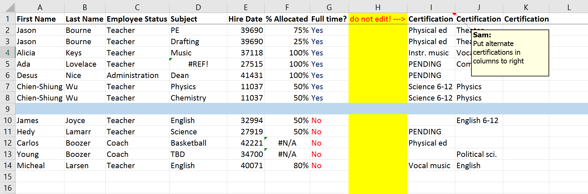

<!-- README.md is generated from README.Rmd. Please edit that file -->

> Data scientists, according to interviews and expert estimates, spend
> from 50 percent to 80 percent of their time mired in this more mundane
> labor of collecting and preparing unruly digital data, before it can
> be explored for useful nuggets.
>
> – [“For Big-Data Scientists, ‘Janitor Work’ Is Key Hurdle to
> Insight”](https://www.nytimes.com/2014/08/18/technology/for-big-data-scientists-hurdle-to-insights-is-janitor-work.html)
> *(New York Times, 2014)*

# janitor 

------------------------------------------------------------------------

<!-- badges: start -->

[](https://github.com/sfirke/janitor/actions/workflows/R-CMD-check.yaml)
[](https://app.codecov.io/github/sfirke/janitor?branch=master)
[](https://lifecycle.r-lib.org/articles/stages.html#stable)
[](https://cran.r-project.org/package=janitor)


<!-- badges: end -->

**janitor** has simple functions for examining and cleaning dirty data.
It was built with beginning and intermediate R users in mind and is
optimized for user-friendliness. Advanced R users can perform many of
these tasks already, but with janitor they can do it faster and save
their thinking for the fun stuff.

The main janitor functions:

- perfectly format data.frame column names;
- create and format frequency tables of one, two, or three variables -
  think an improved `table()`; and
- provide other tools for cleaning and examining data.frames.

The tabulate-and-report functions approximate popular features of SPSS
and Microsoft Excel.

janitor is a
[\#tidyverse](https://CRAN.R-project.org/package=tidyverse/vignettes/manifesto.html)-oriented
package. Specifically, it plays nicely with the `%>%` pipe and is
optimized for cleaning data brought in with the
[readr](https://github.com/tidyverse/readr) and
[readxl](https://github.com/tidyverse/readxl) packages.

### Installation

You can install:

- the most recent officially-released version from CRAN with

  ``` r
  install.packages("janitor")
  ```

- the latest development version from GitHub with

  ``` r
  install.packages("devtools")
  devtools::install_github("sfirke/janitor")
  ```

## Using janitor

A full description of each function, organized by topic, can be found in
janitor’s [catalog of functions
vignette](https://sfirke.github.io/janitor/articles/janitor.html). There
you will find functions not mentioned in this README, like
`compare_df_cols()` which provides a summary of differences in column
names and types when given a set of data.frames.

Below are quick examples of how janitor tools are commonly used.

### Cleaning dirty data

Take this roster of teachers at a fictional American high school, stored
in the Microsoft Excel file
[dirty_data.xlsx](https://github.com/sfirke/janitor/blob/master/dirty_data.xlsx):


Dirtiness includes:

- A header at the top
- Dreadful column names
- Rows and columns containing Excel formatting but no data
- Dates in two different formats in a single column (MM/DD/YYYY and
  numbers)
- Values spread inconsistently over the “Certification” columns

Here’s that data after being read in to R:

``` r
library(readxl); library(janitor); library(dplyr); library(here)

roster_raw <- read_excel(here("dirty_data.xlsx")) # available at https://github.com/sfirke/janitor
glimpse(roster_raw)
#> Rows: 14
#> Columns: 11
#> $ `Data most recently refreshed on:` <chr> "First Name", "Jason", "Jason", "Alicia", "Ada", "Desus", "Chien-…
#> $ ...2                               <chr> "Last Name", "Bourne", "Bourne", "Keys", "Lovelace", "Nice", "Wu"…
#> $ ...3                               <chr> "Employee Status", "Teacher", "Teacher", "Teacher", "Teacher", "A…
#> $ `Dec-27 2020`                      <chr> "Subject", "PE", "Drafting", "Music", NA, "Dean", "Physics", "Che…
#> $ ...5                               <chr> "Hire Date", "39690", "43479", "37118", "38572", "42791", "11037"…
#> $ ...6                               <chr> "% Allocated", "0.75", "0.25", "1", "1", "1", "0.5", "0.5", NA, "…
#> $ ...7                               <chr> "Full time?", "Yes", "Yes", "Yes", "Yes", "Yes", "Yes", "Yes", NA…
#> $ ...8                               <chr> "do not edit! --->", NA, NA, NA, NA, NA, NA, NA, NA, NA, NA, NA, …
#> $ ...9                               <chr> "Certification", "Physical ed", "Physical ed", "Instr. music", "P…
#> $ ...10                              <chr> "Certification", "Theater", "Theater", "Vocal music", "Computers"…
#> $ ...11                              <chr> "Active?", "YES", "YES", "YES", "YES", "YES", "YES", "YES", NA, "…
```

Now, to clean it up, starting with the column names.

Name cleaning comes in two flavors. `make_clean_names()` operates on
character vectors and can be used during data import:

``` r
roster_raw_cleaner <- read_excel(here("dirty_data.xlsx"), 
                                 skip = 1,
                                 .name_repair = make_clean_names)
glimpse(roster_raw_cleaner)
#> Rows: 13
#> Columns: 11
#> $ first_name        <chr> "Jason", "Jason", "Alicia", "Ada", "Desus", "Chien-Shiung", "Chien-Shiung", NA, "J…
#> $ last_name         <chr> "Bourne", "Bourne", "Keys", "Lovelace", "Nice", "Wu", "Wu", NA, "Joyce", "Lamarr",…
#> $ employee_status   <chr> "Teacher", "Teacher", "Teacher", "Teacher", "Administration", "Teacher", "Teacher"…
#> $ subject           <chr> "PE", "Drafting", "Music", NA, "Dean", "Physics", "Chemistry", NA, "English", "Sci…
#> $ hire_date         <dbl> 39690, 43479, 37118, 38572, 42791, 11037, 11037, NA, 36423, 27919, 42221, 34700, 4…
#> $ percent_allocated <dbl> 0.75, 0.25, 1.00, 1.00, 1.00, 0.50, 0.50, NA, 0.50, 0.50, NA, NA, 0.80
#> $ full_time         <chr> "Yes", "Yes", "Yes", "Yes", "Yes", "Yes", "Yes", NA, "No", "No", "No", "No", "No"
#> $ do_not_edit       <lgl> NA, NA, NA, NA, NA, NA, NA, NA, NA, NA, NA, NA, NA
#> $ certification     <chr> "Physical ed", "Physical ed", "Instr. music", "PENDING", "PENDING", "Science 6-12"…
#> $ certification_2   <chr> "Theater", "Theater", "Vocal music", "Computers", NA, "Physics", "Physics", NA, "E…
#> $ active            <chr> "YES", "YES", "YES", "YES", "YES", "YES", "YES", NA, "YES", "YES", "YES", "YES", "…
```

`clean_names()` is a convenience version of `make_clean_names()` that
can be used for piped data.frame workflows. The equivalent steps with
`clean_names()` would be:

``` r
roster_raw <- roster_raw %>%
  row_to_names(row_number = 1) %>%
  clean_names()
```

The data.frame now has clean names. Let’s tidy it up further:

``` r
roster <- roster_raw %>%
  remove_empty(c("rows", "cols")) %>%
  remove_constant(na.rm = TRUE, quiet = FALSE) %>% # remove the column of all "Yes" values 
  mutate(hire_date = convert_to_date(hire_date, # handle the mixed-format dates
                                     character_fun = lubridate::mdy),
         cert = dplyr::coalesce(certification, certification_2)) %>%
  select(-certification, -certification_2) # drop unwanted columns
#> Removing 1 constant columns of 10 columns total (Removed: active).

roster
#> # A tibble: 12 × 8
#>    first_name   last_name employee_status subject    hire_date  percent_allocated full_time cert          
#>    <chr>        <chr>     <chr>           <chr>      <date>     <chr>             <chr>     <chr>         
#>  1 Jason        Bourne    Teacher         PE         2008-08-30 0.75              Yes       Physical ed   
#>  2 Jason        Bourne    Teacher         Drafting   2019-01-14 0.25              Yes       Physical ed   
#>  3 Alicia       Keys      Teacher         Music      2001-08-15 1                 Yes       Instr. music  
#>  4 Ada          Lovelace  Teacher         <NA>       2005-08-08 1                 Yes       PENDING       
#>  5 Desus        Nice      Administration  Dean       2017-02-25 1                 Yes       PENDING       
#>  6 Chien-Shiung Wu        Teacher         Physics    1930-03-20 0.5               Yes       Science 6-12  
#>  7 Chien-Shiung Wu        Teacher         Chemistry  1930-03-20 0.5               Yes       Science 6-12  
#>  8 James        Joyce     Teacher         English    1999-09-20 0.5               No        English 6-12  
#>  9 Hedy         Lamarr    Teacher         Science    1976-06-08 0.5               No        PENDING       
#> 10 Carlos       Boozer    Coach           Basketball 2015-08-05 <NA>              No        Physical ed   
#> 11 Young        Boozer    Coach           <NA>       1995-01-01 <NA>              No        Political sci.
#> 12 Micheal      Larsen    Teacher         English    2009-09-15 0.8               No        Vocal music
```

### Examining dirty data

#### Finding duplicates

Use `get_dupes()` to identify and examine duplicate records during data
cleaning. Let’s see if any teachers are listed more than once:

``` r
roster %>% get_dupes(contains("name"))
#> # A tibble: 4 × 9
#>   first_name   last_name dupe_count employee_status subject   hire_date  percent_allocated full_time cert     
#>   <chr>        <chr>          <int> <chr>           <chr>     <date>     <chr>             <chr>     <chr>    
#> 1 Chien-Shiung Wu                 2 Teacher         Physics   1930-03-20 0.5               Yes       Science …
#> 2 Chien-Shiung Wu                 2 Teacher         Chemistry 1930-03-20 0.5               Yes       Science …
#> 3 Jason        Bourne             2 Teacher         PE        2008-08-30 0.75              Yes       Physical…
#> 4 Jason        Bourne             2 Teacher         Drafting  2019-01-14 0.25              Yes       Physical…
```

Yes, some teachers appear twice. We ought to address this before
counting employees.

#### Tabulating tools

A variable (or combinations of two or three variables) can be tabulated
with `tabyl()`. The resulting data.frame can be tweaked and formatted
with the suite of `adorn_` functions for quick analysis and printing of
pretty results in a report. `adorn_` functions can be helpful with
non-tabyls, too.

#### tabyl()

Like `table()`, but pipe-able, data.frame-based, and fully featured.

`tabyl` can be called two ways:

- On a vector, when tabulating a single variable:
  `tabyl(roster$subject)`
- On a data.frame, specifying 1, 2, or 3 variable names to tabulate:
  `roster %>% tabyl(subject, employee_status)`.
  - Here the data.frame is passed in with the `%>%` pipe; this allows
    `tabyl` to be used in an analysis pipeline

One variable:

``` r
roster %>%
  tabyl(subject)
#>     subject n    percent valid_percent
#>  Basketball 1 0.08333333           0.1
#>   Chemistry 1 0.08333333           0.1
#>        Dean 1 0.08333333           0.1
#>    Drafting 1 0.08333333           0.1
#>     English 2 0.16666667           0.2
#>       Music 1 0.08333333           0.1
#>          PE 1 0.08333333           0.1
#>     Physics 1 0.08333333           0.1
#>     Science 1 0.08333333           0.1
#>        <NA> 2 0.16666667            NA
```

Two variables:

``` r
roster %>%
  filter(hire_date > as.Date("1950-01-01")) %>%
  tabyl(employee_status, full_time)
#>  employee_status No Yes
#>   Administration  0   1
#>            Coach  2   0
#>          Teacher  3   4
```

Three variables:

``` r
roster %>%
  tabyl(full_time, subject, employee_status, show_missing_levels = FALSE)
#> $Administration
#>  full_time Dean
#>        Yes    1
#> 
#> $Coach
#>  full_time Basketball NA_
#>         No          1   1
#> 
#> $Teacher
#>  full_time Chemistry Drafting English Music PE Physics Science NA_
#>         No         0        0       2     0  0       0       1   0
#>        Yes         1        1       0     1  1       1       0   1
```

##### Adorning tabyls

The `adorn_` functions dress up the results of these tabulation calls
for fast, basic reporting. Here are some of the functions that augment a
summary table for reporting:

``` r
roster %>%
  tabyl(employee_status, full_time) %>%
  adorn_totals("row") %>%
  adorn_percentages("row") %>%
  adorn_pct_formatting() %>%
  adorn_ns() %>%
  adorn_title("combined")
#>  employee_status/full_time         No        Yes
#>             Administration   0.0% (0) 100.0% (1)
#>                      Coach 100.0% (2)   0.0% (0)
#>                    Teacher  33.3% (3)  66.7% (6)
#>                      Total  41.7% (5)  58.3% (7)
```

Pipe that right into `knitr::kable()` in your RMarkdown report.

These modular adornments can be layered to reduce R’s deficit against
Excel and SPSS when it comes to quick, informative counts. Learn more
about `tabyl()` and the `adorn_` functions from the [tabyls
vignette](https://sfirke.github.io/janitor/articles/tabyls.html).

## Contact me

You are welcome to:

- submit suggestions and report bugs:
  <https://github.com/sfirke/janitor/issues>
- let me know what you think on Mastodon:
  [@samfirke@a2mi.social](https://a2mi.social/@samfirke)
- compose a friendly e-mail to:
  
